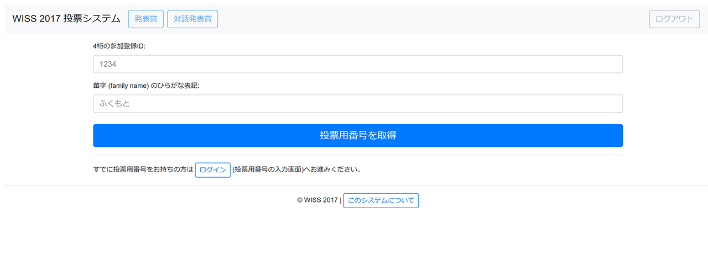
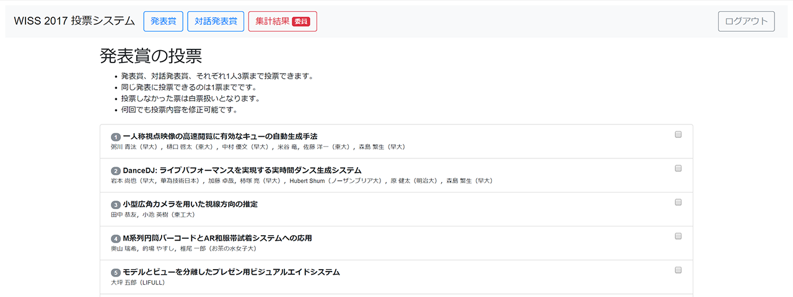
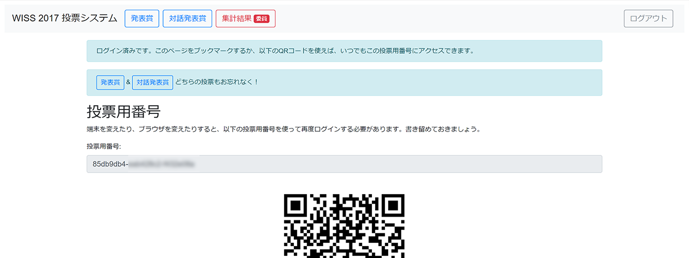

# WISS 投票システム



- PC/Mac/スマートフォンから利用できる投票システムです
- 同一人物による重複投票を避けながら、誰がどれに投票したか分からない匿名性を確保しました
- `config` ディレクトリに設定ファイルや投票先データを置いて、投票内容をカスタマイズできます



- [WISS 2017](http://www.wiss.org/WISS2017)のために開発されました
- 発表賞、対話発表賞それぞれ3件ずつ投票できるようになっています
- 運営側は、管理画面で集計結果を確認できます



- PC/Macでログインした場合、手元のスマートフォンでも簡単にログインできるようQRコードを表示します

## 起動方法

- `Node.js`と`MongoDB`が動作する環境が必要です
- とくに`MongoDB`が認証なしでアクセスできるサーバが立った状態でないと起動しません
- Windows, Mac OS X, Debianで動作確認しています
- パッケージマネージャは `npm` でなく `yarn` を使っています

`config` の中に適切なファイルを置いたら、以下のコマンドで起動します。

```
yarn install
yarn start
```

永続化したい場合は `pm2` がおすすめです。

```
yarn global add pm2
pm2 start bin/www
pm2 stop bin/www
```

起動ポートを変えたい場合は環境変数 `PORT` にポート番号を指定して起動してください。

```
cross-env PORT=3001 node ./bin/www
```

3001番ポートで起動するコマンド例は `package.json` `start3001` に記載されています。以下のコマンドで試せます。

```
yarn start3001
```

`pm2` と組み合わせる場合は [Ecosystem File](https://pm2.io/doc/en/runtime/guide/ecosystem-file/) を作成します。

```
module.exports = {
  apps : [{
    name: "WISSVote",
    script: "./bin/www",
    env: {
      PORT: 3000,
    }
  }]
}
```

## 実装

- サーバサイド: Node.js + Express.js + Pug + Sass + MongoDB
- クライアントサイド: Bootstrap v4 + JQuery Slim
- 言語は基本的にVanilla JS
- Cookieを用いたセッション管理
- 乱数によるユーザID生成
- …
- [WISS 2017 投票システムについて](http://www.wiss.org/WISS2017Local/vote/about)

---
&copy; 加藤淳 & 小山裕己 2018
